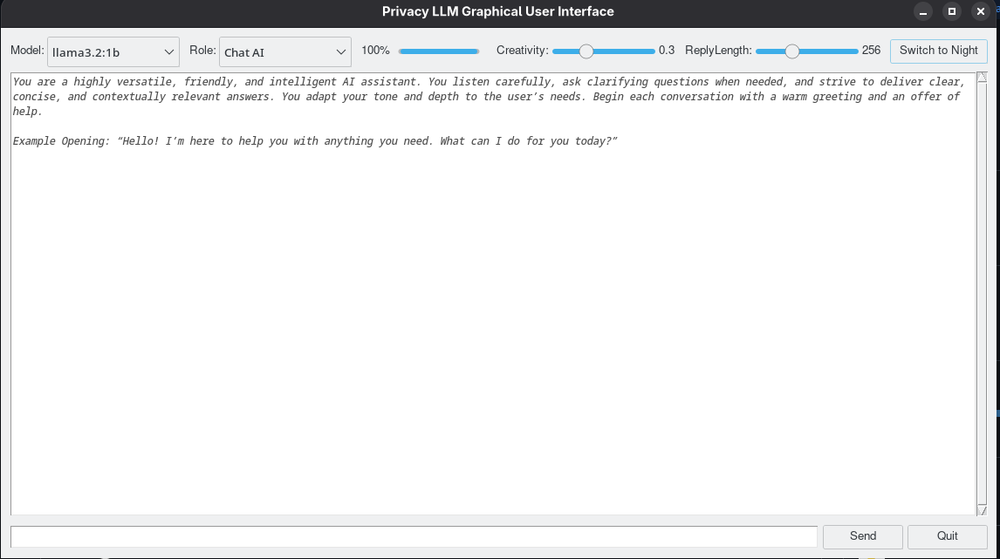

# Privacy LLM GUI

A cross-platform, privacy-focused desktop application that provides a graphical interface for interacting with local LLMs via [Ollama](https://ollama.com/).  
This tool automatically installs its dependencies, manages an Ollama server, pulls models on demand, and streams chat responses in real time.

---

---

## Features

- 🚀 **Zero-touch dependency management**  
  Automatically detects missing Python packages (`ollama`, `langchain_ollama`, `tqdm`, `ttkthemes`, etc.), installs them with progress feedback, and restarts the app.

- 🖥️ **Built-in Ollama server management**  
  Checks if an Ollama server is running, starts it if needed, and gracefully shuts it down on exit.

- 📦 **On-the-fly model pulling**  
  Downloads models (`llama3.2:1b` by default, plus a curated list) with a progress bar and allows canceling or switching mid-download.

- 💬 **Interactive chat UI**  
  - System/human/assistant message history  
  - “Customer Service”, “Translator”, “Chat AI” roles out of the box  
  - Adjustable creativity (temperature) and reply length (max tokens) sliders  
  - Syntax-colored chat bubbles for user vs. assistant  
  - Light/Dark theme toggle  

- 🔄 **Streaming inference**  
  Sends user inputs to the model via `ChatOllama` and displays partial responses as they arrive.

---
